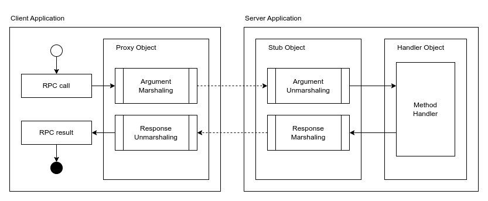

# Distributed Component Object Model

Distributed Component Object Model (DCOM) is a personal project that is heavily inspired by Microsoft's [Component Object Model (COM)](https://learn.microsoft.com/en-us/windows/win32/com/the-component-object-model). It is written natively in Go and currently supports these features:

- Basic data types: **bool**, **int**, **float**, **string**
- Optional & array data types
- Compound data types (structures)
- Memory-efficient binary serialization
- Remote Procedure Calls (RPC) using interfaces
- Interface Definition Language (IDL) using XML
- Public and private method access
- Single-threaded and multi-threaded handling

You can take a look at the [example](./example) on how the generated code and implementation look like. The corresponding IDL can also be seen [here](./idl/_example/).

## Architecture



### Object Life Cycle

Every instance has its own **reference count** that tracks how many ownerships over that particular object. A potential owner (either local or remote) may call `Acquire` method in order to obtain ownership over an object hence incrementing the number of references on that object. After finished using its resources, the owner should call `Release` to give away its ownership over that object hence decrementing the reference count. When an object's reference count reaches zero, it will automatically **destroy** itself, hence remotely inaccessible. Initial object creations set the reference count number to one so that the creator is also responsible for releasing the objects it has created.

## Interface Definition Language

The Interface Definition Language (IDL) uses XML format with this structure:

```xml
<?xml version="1.0" encoding="utf-8"?>
<idl>
    <structure name="StructureName">
        <property name="structureMember01" type="int" />
        <property name="structureMember02" type="string" />
        <property name="structureMember03" type="#AnotherStructure" />
    </structure>

    <interface name="InterfaceName" clsid="9fddbe0e-d42e-4d01-b558-68fcc704c7d9">
        <method name="someMethod" return="bool">
            <param name="arg01" type="float" />
            <param name="arg02" type="string[]" />
            <param name="arg03" type="@AnotherInterface[]" />
            <param name="arg04" type="#SomeStructure?" />
        </method>

        <method name="someMethodWithoutParam" return="@AnotherInterface" access="public" />

        <method name="someMethodWithoutReturn" access="private">
            <param name="arg01" type="#SomeStructure" />
            <param name="arg02" type="int?" />
        </method>
    </interface>
</idl>
```

The Golang code for the component (i.e. interfaces and structures), proxy, and stub can be generated from the IDL with these steps:

1. Define your IDL file inside the **idl/_inventory** directory
2. Configure **blueprint.json** based on [this template](./idl/blueprint.example.json)
3. Generate using `$ go run main.go`
4. Files can be accessed inside the **idl/_generated** directory

### Data Types

A data type can be one of these types:

- Primitive: `bool`, `int`, `float`, `string`
- Structure with `#` prefix, e.g. `#Contact`
- Interface with `@` prefix, e.g. `@Person`

We can also define an optional type using `?` suffix or array type using `[]` suffix. For example: `string[]`, `#Contact[]`, `@Person?`.

Below shows the storage requirements table for each data type

Data Type           | Size 
--------------------|------------------------
`bool`              | 1 byte
`int`               | 8 bytes
`float`             | 8 bytes
`string`            | (8 + N) bytes
Any structure       | (X_i + ... + X_n) bytes
Any object          | 32 bytes
Any optional type   | (1 + X) bytes
Any array type      | (8 + N * X) bytes

### Interface

An interface acts as a middleware to an object instance. It provides methods that can be used to access or manipulate the underlying object. A method can be either **private** or **public** (default), specified with the `access` IDL attribute. A private method can only be called locally (i.e. within the same program) whereas a public method can be called both locally and remotely across different programs.

Interfaces should also provide the object's class ID (i.e. CLSID) represented by Universally Unique Identifiers (UUIDs). The class ID is used by the DCOM engine to handle routing of the objects.

### Structures

A structure is a compound data type that can contain multiple data types. A structure type can include another structure but **cannot** include an object.
